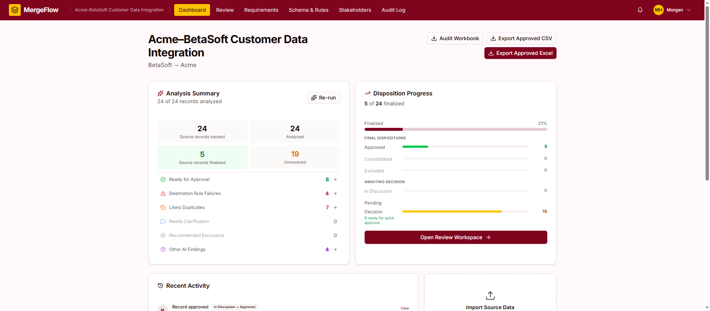
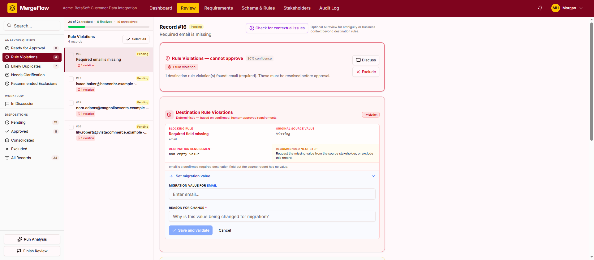
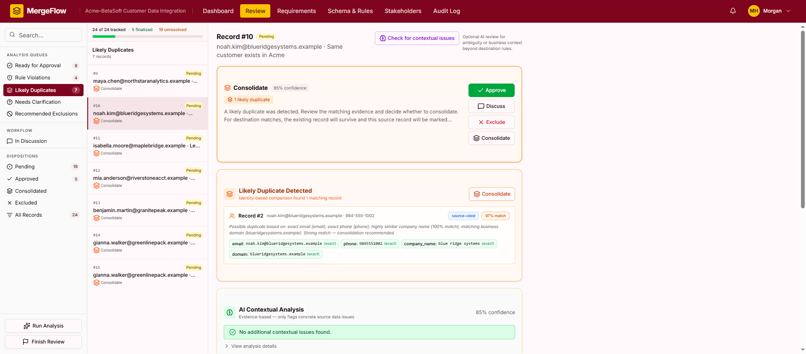
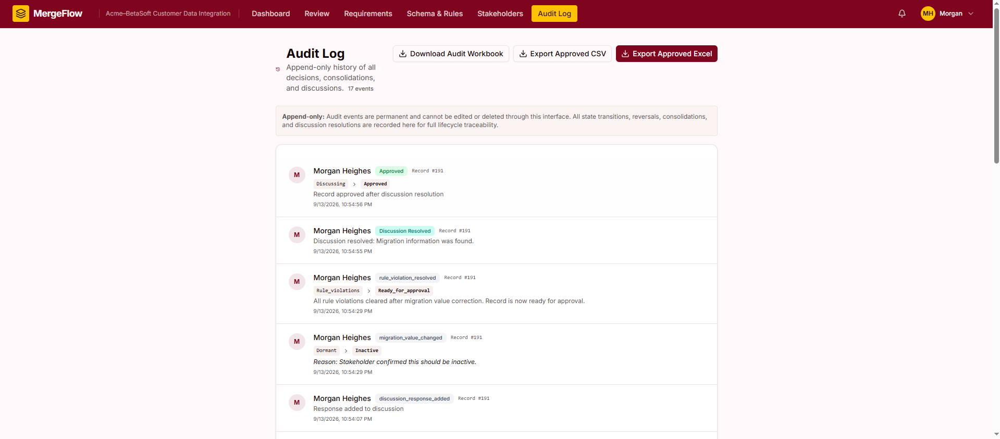

# MergeFlow

**Human-in-the-loop data migration workspace for integrations and M&A.**

MergeFlow was created during **Aha! AI Builder Day 2026** to explore how AI-assisted software can make complex business data migrations easier to review, coordinate, and audit without removing human judgment from important decisions.

## Video Demo

[Watch the 3-minute MergeFlow demo](https://www.youtube.com/watch?v=ynqK7gvDWjo)

## What is MergeFlow?

MergeFlow is a data migration workspace designed for integrations and mergers and acquisitions.

Users can define source and destination data, establish destination requirements, map fields, review problematic records, collaborate on missing information, identify possible duplicates, and export approved migration data.

AI assists with identifying and explaining potential issues, while people remain responsible for final migration decisions.

## The Problem

Large data migrations require teams to determine what information should move into a new system, what is missing, what conflicts with destination requirements, and what may already exist.

These decisions can involve project managers, data owners, technical teams, and other business stakeholders. When the process relies heavily on spreadsheets, email, and manual review, decisions can become difficult to coordinate and trace.

MergeFlow was designed to organize that work into a single review workflow.

## Who It Is For

The primary user is a **project manager coordinating a data migration during an integration or acquisition**.

MergeFlow can also support data managers, product managers, technical teams, and subject-matter experts who need to review or clarify specific records.

## Key Features

- Source and destination dataset setup
- Destination requirement definition and validation
- Source-to-destination field mapping
- Deterministic rule validation
- AI-assisted contextual review
- Likely duplicate detection and comparison
- Human approval and disposition decisions
- Stakeholder discussions tied directly to records
- Separate source values and migration values
- Record revalidation after corrections
- Detailed audit history
- Bulk review actions
- Approved-data CSV and Excel exports
- Migration audit workbook export

## Human Judgment and Trust

A major design goal of MergeFlow was keeping AI assistance separate from human decision-making.

AI can help identify issues and provide context, but it does not provide final approval.

The application also preserves original source data separately from corrected migration values. This allows teams to make necessary changes for the destination system without silently overwriting the original record.

Important actions such as discussions, value changes, resolutions, and approvals are recorded in the audit history.

## Validation and Testing

The project was developed iteratively using a synthetic acquisition scenario in which **BetaSoft customer data was migrated into Acme's customer system**.

I created structured source and destination datasets containing:

- clean migration records
- missing required values
- invalid destination values
- source-to-destination duplicates
- source-to-source duplicates
- conflicting customer information
- ambiguous historical metadata
- records requiring business clarification

Multiple testing rounds were used to identify incorrect assumptions and refine the workflows for validation, duplicate detection, stakeholder clarification, auditability, and migration decisions.

## Product Research

Before finalizing the workflow, I spoke with someone who had experience participating in real-world data migrations.

That conversation helped shape several parts of MergeFlow, including:

- focusing on nontechnical usability
- supporting collaboration across different business roles
- preserving human validation
- making migration status visible
- reducing manual data-cleaning work
- supporting CSV and Excel workflows
- maintaining an audit trail of migration decisions

## My Role

I was responsible for the product concept, problem research, requirements, workflow design, testing strategy, test datasets, iterative validation, product decisions, and final demonstration.

The application was built using **Aha! Builder and its AI development assistant** during AI Builder Day 2026.

AI-assisted development generated a significant portion of the implementation. I directed and evaluated that work through requirements, testing, debugging feedback, and repeated product iterations.

This repository preserves the exported source code from the final hackathon version.

## Technology

The exported application includes:

- TypeScript
- React
- PostgreSQL schema and migrations
- Server-side TypeScript
- AI-assisted analysis logic
- CSV and Excel processing

The original application also relied on Aha! Builder infrastructure for services such as AI execution, authentication, database connectivity, and other runtime functionality.

## AI Builder Day 2026

MergeFlow was submitted to the **Aha! + Pragmatic Institute AI Builder Day 2026** competition.

The project was built and tested during the event's limited development window and submitted as a working prototype with a three-minute product demonstration.

Although MergeFlow was not selected as an award winner, the project provided valuable experience in product discovery, stakeholder research, AI-assisted development, testing, iteration, and shipping software under a deadline.

## Current Status

This repository currently preserves the **final exported AI Builder Day version** of MergeFlow.

The exact hackathon source snapshot is available through the Git tag:

`ai-builder-day-2026-final`

The original application depends on portions of the Aha! Builder runtime and is not currently maintained as a standalone production deployment.

## Screenshots

### Migration Dashboard

### Human-in-the-loop remediation

### Duplicate review

### Auditable decision history

## Project Status

**Hackathon prototype complete — September 2026**